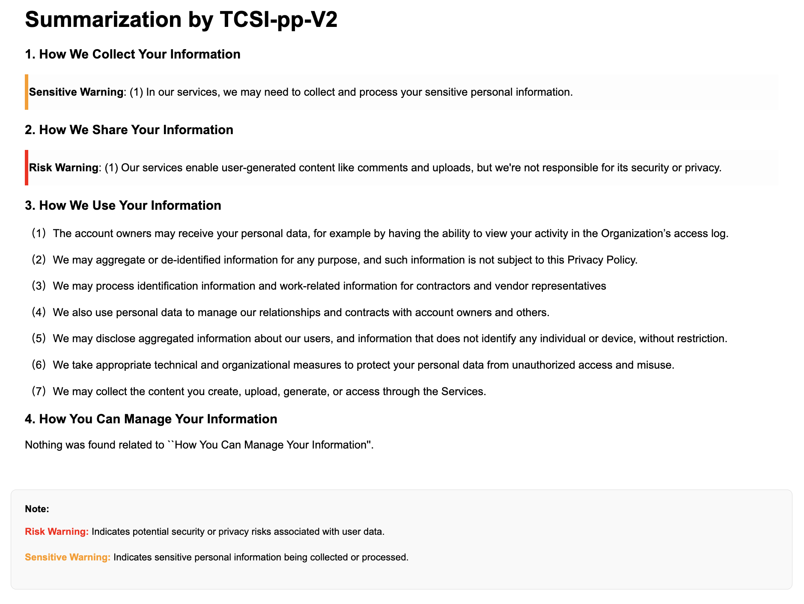

## APPSI-139 & TCSI-pp-V2

This repository contains **APPSI-139**, a parallel corpus of English privacy policies annotated by legal experts for user-friendly interpretations, and **TCSI-pp-V2**, a multi-task summarization framework. 

The system is designed to generate accurate and readable summaries of privacy policies, helping users make more informed privacy decisions. Evaluations show it outperforms general-purpose LLMs like GPT-4o in readability and reliability.


👉 The annotation work for this English privacy policy dataset was conducted by five experts, all of whom hold a master’s degree in law and possess official lawyer certifications. Prior to the project, all annotators underwent systematic training, including guideline walkthroughs, and annotated examples to ensure annotation quality and stability. For more details, see the [Annotation Guidelines (PNG)](Documents/Annotation_Guidelines.png) or [Annotation Guidelines (PDF)](Documents/Annotation_Guidelines.pdf).

<!-- [Paper](Documents/Annotation_Guidelines_Chinese_Version.pdf), [Appendix](Documents/Annotation_Guidelines_Chinese_Version.pdf) and -->
## How to Use

Install project dependencies:

```bash
pip install -r requirements.txt
```
Train a model using the following command:
```
python ./TCSI-pp-V2/[MODEL_NAME]_rewrite_ddp2_model.py
```

Run inference with the following command:
```bash
python ./Infer/main.py --topic_list choose_a_topic_list  --data privacy_path
```

✨ **new** Below is the **In-Context Learning Instruction Template** used in this experiment.

```bash

- **Task Description:** You are an expert in privacy policies. Please analyze the following privacy policy text sentence by sentence and summarize it in clear and simple language so that non-expert users can easily understand.

- **Example 1:**
  - Privacy Policy Clause: "Insert Privacy Policy"
  - Summary: "Insert Summary"
- **Example 2:**
  - Privacy Policy Clause: "Insert Privacy Policy"
  - Summary: "Insert Summary"
- Based on the examples above, please summarize the following privacy policy text: "Insert Privacy Policy"
- Summary:
```

✨ **new** The mt5_mtl_model (based on TCSI-pp-V2) is currently hosted at the following [link](https://huggingface.co/EnlightenedAI/APPSI-139/tree/main). Additionally, we will be uploading all associated model parameters to this same location for easy access and reference.

Figure shows a sample summarization result generated by TCSI-pp-V2:



## 📌 Update

This repository is under continuous development.  
Stay tuned for regular updates and enhancements.


